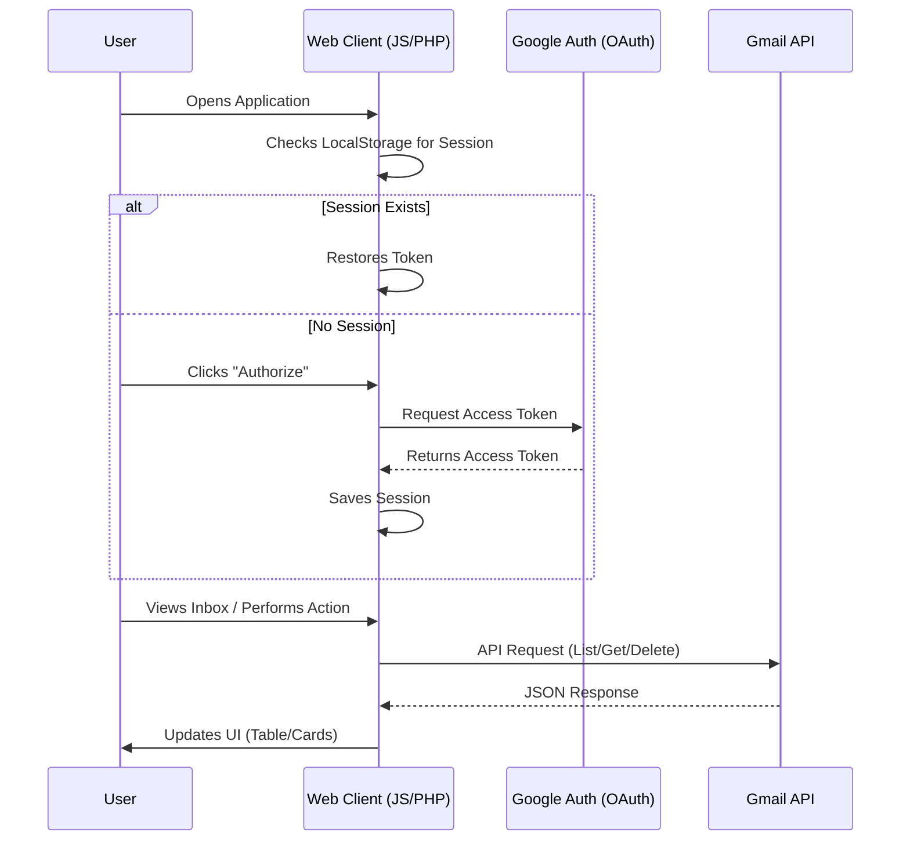
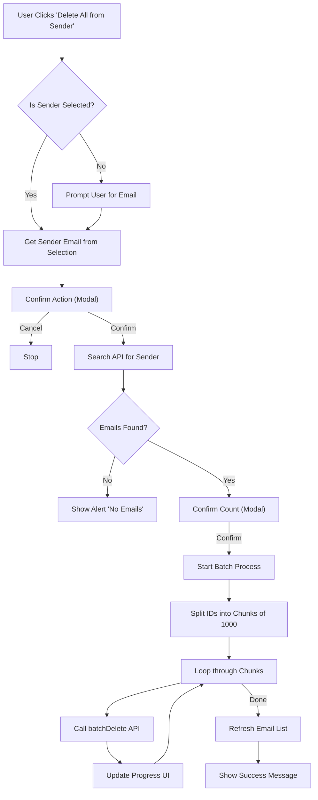

# Gmail Manager & Cleanup Tool

A powerful, responsive web application to manage your Gmail inbox efficiently. Built with PHP, Tailwind CSS, and the Gmail API, this tool offers advanced features like bulk deletion by sender, dark mode, and a dedicated cleanup dashboard.

## 🚀 Features

### 📧 Email Management
- **Responsive Interface**: Seamless experience across Mobile, Tablet, Desktop, and TV screens.
- **View Emails**: Clean list view (Table on Desktop, Cards on Mobile) with sender, subject, date, and labels.
- **Read Mode**: Full-screen modal to read email content (HTML/Text) without leaving the app.
- **Search**: Real-time search functionality to find specific emails.

### 🛠️ Advanced Actions
- **Bulk Delete**: Select multiple emails and delete them in one click.
- **Delete by Sender**: Powerful feature to find and delete **ALL** emails from a specific sender (batch processing).
- **Label Management**: Quickly apply or remove labels (Star, Unread, Important) from selected emails.

### 📊 Stats & Cleanup
- **Dashboard**: Dedicated `All Emails Stats` page showing total message and thread counts.
- **Nuclear Option**: A "Delete All Emails" feature for complete inbox clearing (protected by double confirmation).

### 🎨 UI/UX
- **Dark Mode**: Fully supported dark theme with persistence (saves preference).
- **Session Persistence**: Stay logged in even after refreshing the page (tokens saved in LocalStorage).
- **Custom Modals**: Beautiful, non-intrusive confirmation and alert dialogs.

## 🛠️ Tech Stack
- **Frontend**: HTML5, JavaScript (ES6+), Tailwind CSS (via CDN).
- **Backend**: PHP (for credential handling).
- **API**: Google Gmail API (v1), Google Identity Services (OAuth 2.0).
- **Authentication**: Secure OAuth flow with `credentials.json`.

## 📸 Screenshots

|Search Mail | Confirm Delete Batch |
|:---:|:---:|
|  |  |

| Toggle Theme | Delete Entire Mails |
|:---:|:---:|
|  |  |

## 🔄 Request Flow

This diagram illustrates how the user interacts with the application and how data flows between the client and Google's servers.



## ⚙️ Process Flow

This chart details the internal logic for the "Delete All from Sender" feature, showcasing the batch processing capability.



## 📥 Setup Instructions

1.  **Clone the Repo**:
    ```bash
    git clone https://github.com/yourusername/gmail-manager.git
    ```
2.  **Configure Credentials**:
    *   Go to [Google Cloud Console](https://console.cloud.google.com/).
    *   Create a project and enable the **Gmail API**.
    *   Create OAuth 2.0 Client ID credentials.
    *   Download the JSON file and rename it to `credentials.json`.
    *   Place `credentials.json` in the root directory.
3.  **Run Local Server**:
    *   Use WAMP/XAMPP or PHP built-in server:
    ```bash
    php -S localhost:8000
    ```
4.  **Access**:
    *   Open `http://localhost:8000/manage_gmail.php` in your browser.

## 🔒 Security Note
*   **Credentials**: The `credentials.json` file is read server-side by PHP to inject the Client ID. The Client Secret is **NOT** exposed to the client.
*   **Tokens**: Access tokens are stored in the browser's LocalStorage for session persistence.

---
*Built with ❤️ for efficient email management by AdxStackDev.*
