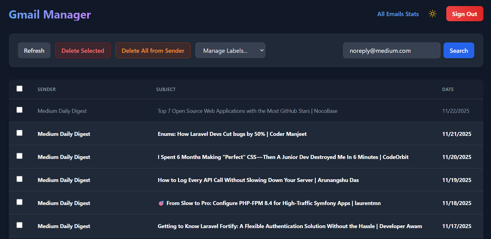
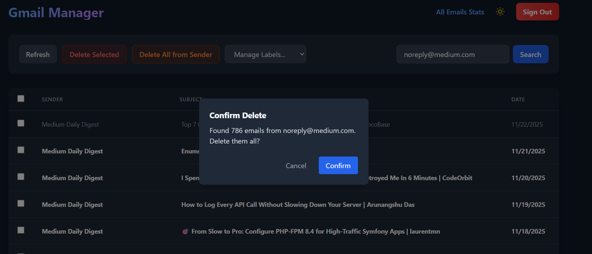
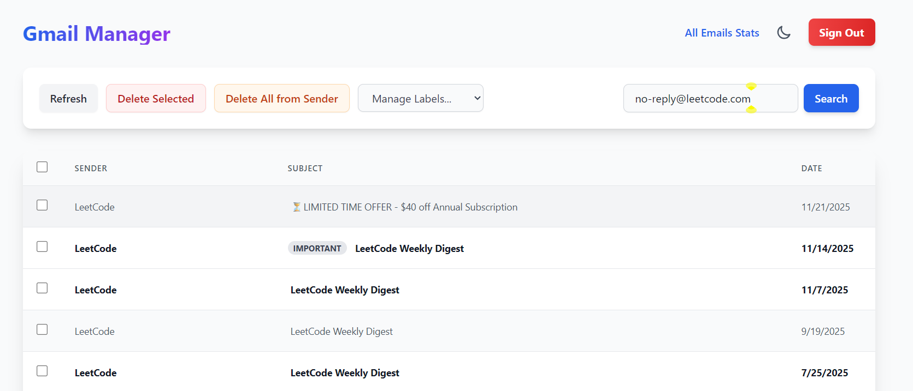
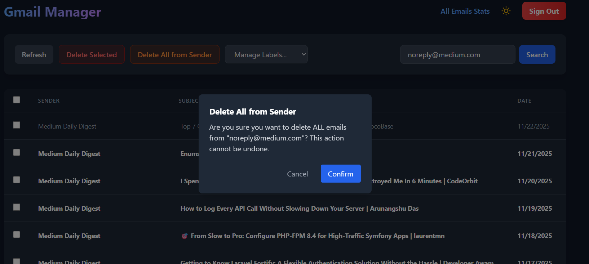
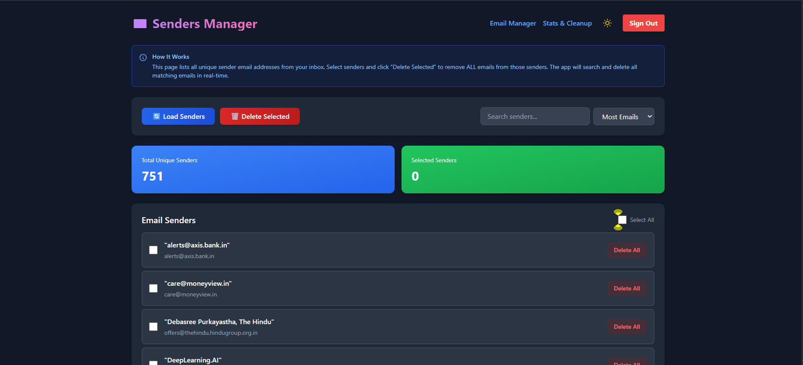

# Gmail Manager & Cleanup Tool

A powerful, responsive web application to manage your Gmail inbox efficiently. Built with PHP, Tailwind CSS, and the Gmail API, this tool offers advanced features like bulk deletion by sender, dark mode, and a dedicated cleanup dashboard.

## 🚀 Features

### 📧 Email Management
- **Responsive Interface**: Seamless experience across Mobile, Tablet, Desktop, and TV screens.
- **View Emails**: Clean list view (Table on Desktop, Cards on Mobile) with sender, subject, date, and labels.
- **Read Mode**: Full-screen modal to read email content (HTML/Text) without leaving the app.
- **Search**: Real-time search functionality to find specific emails.

### 🛠️ Advanced Actions
- **Bulk Delete**: Select multiple emails and delete them in one click.
- **Delete by Sender**: Powerful feature to find and delete **ALL** emails from a specific sender (batch processing).
- **Senders Manager**: NEW! View all unique sender email addresses and batch delete all emails from selected senders.
- **Label Management**: Quickly apply or remove labels (Star, Unread, Important) from selected emails.

### 📊 Stats & Cleanup
- **Dashboard**: Dedicated `All Emails Stats` page showing total message and thread counts.
- **Nuclear Option**: A "Delete All Emails" feature for complete inbox clearing (protected by double confirmation).

### 🎨 UI/UX
- **Dark Mode**: Fully supported dark theme with persistence (saves preference).
- **Session Persistence**: Stay logged in even after refreshing the page (tokens saved securely).
- **Custom Modals**: Beautiful, non-intrusive confirmation and alert dialogs.

### 🔒 Security Features
- **CSRF Protection**: Token-based protection against cross-site request forgery
- **Security Headers**: XSS protection, clickjacking prevention, MIME sniffing protection
- **Rate Limiting**: Client-side rate limiting to prevent API quota exhaustion
- **Secure Token Storage**: SessionStorage instead of LocalStorage for better security
- **Input Sanitization**: All user inputs are properly escaped

## 🛠️ Tech Stack
- **Frontend**: HTML5, JavaScript (ES6+), Tailwind CSS
- **Backend**: PHP 7.4+
- **API**: Google Gmail API (v1), Google Identity Services (OAuth 2.0)
- **Authentication**: Secure OAuth flow with `credentials.json`

## 📸 Screenshots

### Main Email Manager

*Search and filter emails with real-time results*

### Batch Delete Confirmation

*Double confirmation before deleting emails*

### Dark Mode Support

*Seamless dark mode with persistent preferences*

### Delete All Emails

*Nuclear option with multiple confirmations*

### Senders Manager (NEW!)

*View all unique senders and batch delete by sender*

## 📥 Setup Instructions

### Prerequisites
- PHP 7.4 or higher
- A Google Cloud Project with Gmail API enabled
- Web server (Apache, Nginx, or PHP built-in server)

### 1. Clone the Repository
```bash
git clone https://github.com/yourusername/gmail-manager.git
cd gmail-manager
```

### 2. Configure Google OAuth Credentials

#### A. Create Google Cloud Project
1. Go to [Google Cloud Console](https://console.cloud.google.com/)
2. Create a new project or select an existing one
3. Enable the **Gmail API**:
   - Navigate to "APIs & Services" > "Library"
   - Search for "Gmail API"
   - Click "Enable"

#### B. Create OAuth 2.0 Credentials
1. Go to "APIs & Services" > "Credentials"
2. Click "Create Credentials" > "OAuth client ID"
3. Configure the consent screen if prompted
4. Choose "Web application" as the application type
5. Add authorized JavaScript origins:
   - `http://localhost:8000` (for local development)
   - Your production domain (e.g., `https://yourdomain.com`)
6. Add authorized redirect URIs:
   - `http://localhost:8000`
   - Your production domain
7. Click "Create"
8. Download the JSON file

#### C. Setup Credentials File
1. Copy the example file:
   ```bash
   cp credentials.json.example credentials.json
   ```
2. Open `credentials.json` and paste your OAuth credentials
3. **IMPORTANT**: Never commit `credentials.json` to version control (it's already in `.gitignore`)

### 3. Install Dependencies (Optional - for Production)

For production, install Tailwind CSS locally:
```bash
npm install
npm run build:css
```

Then update the PHP files to use the compiled CSS instead of CDN:
```html
<!-- Replace this -->
<script src="https://cdn.tailwindcss.com"></script>

<!-- With this -->
<link rel="stylesheet" href="css/output.css">
```

### 4. Start the Server

#### Option A: PHP Built-in Server (Development)
```bash
php -S localhost:8000
```

#### Option B: Apache/Nginx
Configure your web server to serve the project directory.

### 5. Access the Application
Open your browser and navigate to:
- Main Manager: `http://localhost:8000/manage_gmail.php`
- Senders Manager: `http://localhost:8000/senders.php` ⭐ NEW!
- Stats & Cleanup: `http://localhost:8000/all_emails.php`

### 6. Authorize the Application
1. Click the "Authorize" button
2. Sign in with your Google account
3. Grant the requested permissions:
   - Read, compose, send, and permanently delete all your email from Gmail
   - View and modify but not delete your email

## 🔐 Security Best Practices

### For Development
- Use `localhost` or `127.0.0.1` for testing
- Keep `credentials.json` secure and never commit it
- Use HTTPS in production

### For Production
1. **Use HTTPS**: Always use SSL/TLS certificates
2. **Restrict OAuth Origins**: Only add your production domain
3. **Environment Variables**: Consider using environment variables for sensitive data
4. **Update CSP**: Adjust Content Security Policy for your domain
5. **Regular Updates**: Keep dependencies updated
6. **Backup**: Always backup before using destructive operations

## 📊 API Usage & Quotas

Gmail API has the following quotas:
- **250 quota units per user per second**
- **1 billion quota units per day**

Operations cost:
- List messages: 5 units
- Get message: 5 units
- Batch delete: 50 units
- Modify labels: 5 units

The app includes client-side rate limiting (100 requests per minute) to help prevent quota exhaustion.

## 🎯 Usage Tips

### Senders Manager (NEW!)
The Senders Manager provides a streamlined way to clean up your inbox by sender:

**How to Use:**
1. Navigate to `http://localhost:8000/senders.php`
2. Click "Load Senders" to fetch all unique sender email addresses
3. Browse the list of senders (sorted alphabetically)
4. Use the search box to find specific senders
5. Select one or more senders using checkboxes
6. Click "Delete Selected" to remove ALL emails from selected senders
7. Or click individual "Delete All" buttons for single senders

**Features:**
- ⚡ Fast loading - only fetches unique sender emails
- 🔍 Real-time search and filtering
- ✅ Multi-select with "Select All" option
- 📊 Live statistics showing total and selected senders
- 🗑️ Uses the same proven deletion logic as "Delete by Sender"
- 📈 Progress tracking with visual progress bar
- 🎯 Searches and deletes ALL emails from sender (not limited to first 2000)

**When to Use:**
- Unsubscribe from multiple newsletters at once
- Clean up promotional emails from various senders
- Remove old emails from former colleagues or contacts
- Bulk cleanup of automated notification emails

**Comparison:**

| Feature | Senders Manager | Delete by Sender | Bulk Delete |
|---------|----------------|------------------|-------------|
| View all senders | ✅ Yes | ❌ No | ❌ No |
| Search senders | ✅ Yes | ❌ No | ❌ No |
| Multi-select | ✅ Yes | ❌ No | ✅ Yes |
| Delete ALL emails | ✅ Yes | ✅ Yes | ❌ No |
| Progress tracking | ✅ Yes | ✅ Yes | ❌ No |
| Best for | Bulk sender cleanup | Single sender | Selected emails |

### Bulk Delete by Sender
1. Select an email from the sender (optional - pre-fills the email)
2. Click "Delete All from Sender"
3. Enter or confirm the sender's email address
4. Confirm the action twice
5. Wait for the batch deletion to complete

### Search Functionality
Use Gmail search operators:
- `from:sender@example.com` - Emails from specific sender
- `subject:keyword` - Emails with keyword in subject
- `is:unread` - Unread emails only
- `has:attachment` - Emails with attachments
- `after:2024/01/01` - Emails after a date

### Dark Mode
- Click the moon/sun icon to toggle
- Preference is saved automatically
- Respects system preference by default

## 🐛 Troubleshooting

### "credentials.json not found"
- Make sure you've created `credentials.json` from the example file
- Check that the file is in the root directory

### "Authorization Failed"
- Verify your OAuth credentials are correct
- Check that your domain is in the authorized origins
- Clear browser cache and try again

### "Rate Limit Exceeded"
- Wait a minute before making more requests
- The app has built-in rate limiting (100 req/min)

### Content Security Policy Errors
- Check browser console for specific CSP violations
- Update `config.php` to allow necessary domains

### Blank Page / Nothing Showing
- Check browser console for JavaScript errors
- Verify all script files are loading correctly
- Ensure PHP session is working (`session_start()`)

## 📝 File Structure

```
gmail-manager/
├── manage_gmail.php          # Page entry: main email management interface
├── all_emails.php            # Page entry: stats & cleanup dashboard
├── senders.php               # Page entry: senders analysis & batch delete
├── config.php                # Bootstrap: wires session/headers/config (BC entry)
├── credentials.json          # OAuth credentials (DO NOT COMMIT)
├── credentials.json.example  # Template for credentials
├── .gitignore                # Git ignore rules
├── package.json              # NPM dependencies (optional CSS build)
├── tailwind.config.js        # Tailwind configuration
├── README.md                 # This file
├── app/                      # PHP backend (not the page entry points)
│   ├── Config.php            # Credential loader
│   ├── Security/
│   │   ├── Session.php       # Secure session start
│   │   ├── Csrf.php          # CSRF token issue/verify
│   │   └── Headers.php       # CSP + security headers
│   └── views/
│       └── partials/
│           ├── head.php          # Shared <head>
│           ├── header.php        # Shared nav/header bar
│           └── theme-toggle.php  # Theme toggle button
├── assets/
│   └── css/
│       └── app.css           # Shared component styles (was inline <style>)
├── js/
│   ├── core/                 # Auth + API + session logic
│   │   ├── session.js        # Token persistence
│   │   ├── gmailClient.js    # gapi/GIS bootstrap + rate limiting
│   │   └── auth.js           # Sign-in/out flow + auth UI state
│   ├── ui/                   # Presentation behavior
│   │   ├── toast.js          # Status notifications
│   │   ├── modal.js          # Alert/confirm dialogs
│   │   └── theme.js          # Light/dark theme
│   └── pages/                # Per-page logic
│       ├── manager.js        # manage_gmail.php
│       ├── stats.js          # all_emails.php
│       └── senders.js        # senders.php
├── src/
│   └── input.css             # Tailwind source (for optional production build)
└── snaps/                    # Screenshots
    ├── confirm_delete.png
    ├── delete_all_mail.png
    ├── delete_all_mails.png
    ├── search_mail.png
    ├── sender_manager.png    # Senders Manager page
    └── ThemeToggle.png
```

## 🤝 Contributing

Contributions are welcome! Please:
1. Fork the repository
2. Create a feature branch
3. Make your changes
4. Test thoroughly
5. Submit a pull request

## ⚠️ Disclaimer

This tool has the ability to permanently delete emails. Use with caution:
- Always test with a test account first
- Double-check before confirming deletions
- There is NO undo for deleted emails
- The authors are not responsible for data loss

## 📄 License

MIT License - See LICENSE file for details

## 👨‍💻 Author

Built with ❤️ by AdxStackDev

## 🔗 Links

- [Gmail API Documentation](https://developers.google.com/gmail/api)
- [Google OAuth 2.0](https://developers.google.com/identity/protocols/oauth2)
- [Tailwind CSS](https://tailwindcss.com/)

---

**⭐ If you find this project useful, please consider giving it a star!**
